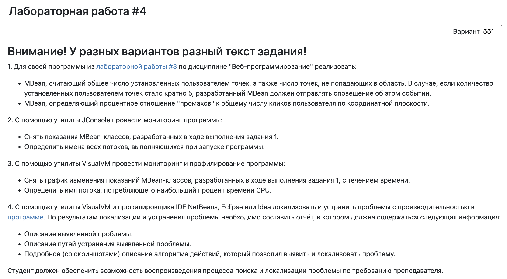
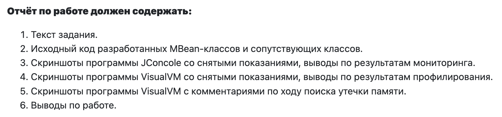
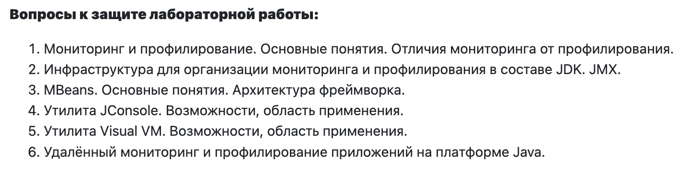

# Лабораторная работа №4 по дисциплине "Методы и средства программной инженерии"

## [Техническое задание](https://se.ifmo.ru/courses/software-engineering-basics):

> ### Текст задания: 
> 

> ### Требования к отчету:
> 

> ### Вопросы для подготовки:
> 

## Авторы:
 
> ### [Тучков Максим Русланович](https://github.com/IndianMax03)
> 
> ### [Аллаяров Игорь Олегович](https://github.com/Xswinger)

## Практик:

> ### [Райла Мартин](https://github.com/seductorAmadeus)

## Лектор:

> ### [Клименков Сергей Викторович](https://edu.itmo.ru/ru/lecturers_and_professors/105395)